# 3D-Printing-Operation-and-Practice
A new attempt at 3D scanning, with post-processing and printing of the model carried out on this occasion.

# 扫描 Scanning
### 工具：Revopoint扫描仪&转台 
### Tools: Revopoint Scanner & Turntable
### 软件：Revo Scan（电脑端） 
### Software: Revo Scan (Computer Version)
## 过程（Process）
####     1、将扫描仪与转台连接到电脑。
#### Connect the scanner and turntable to the computer.
####     2、摆好待扫描的物品，调整合适的距离。（电脑上会有显示，然后也可以看预览效果）
#### Place the item to be scanned properly and adjust it to an appropriate distance. (this will be displayed on the computer, and you can also check the preview effect)

####     3、启动转台，开始扫描，扫描完完整的一圈后结束。
#### Start the turntable to begin scanning, and end the process after scanning a complete circle.
####     4、更换物品摆放角度再次扫描。（为了扫描原来被遮住的部分）
#### Change the placement angle of the item and scan again. (to scan the parts that were originally blocked)

####     5、扫描完成后在软件内合并两次的模型，导出。
#### After scanning is completed, merge the two scanned models in the software and export the merged model.

# 处理 Processing
### 软件：Revo Scan、blender
### Software: Revo Scan, Blender
####     1、先将点云模型在Revo Scan中进行处理，将点云连接成为网格。
#### First, process the point cloud model in Revo Scan to connect the point cloud into a mesh.
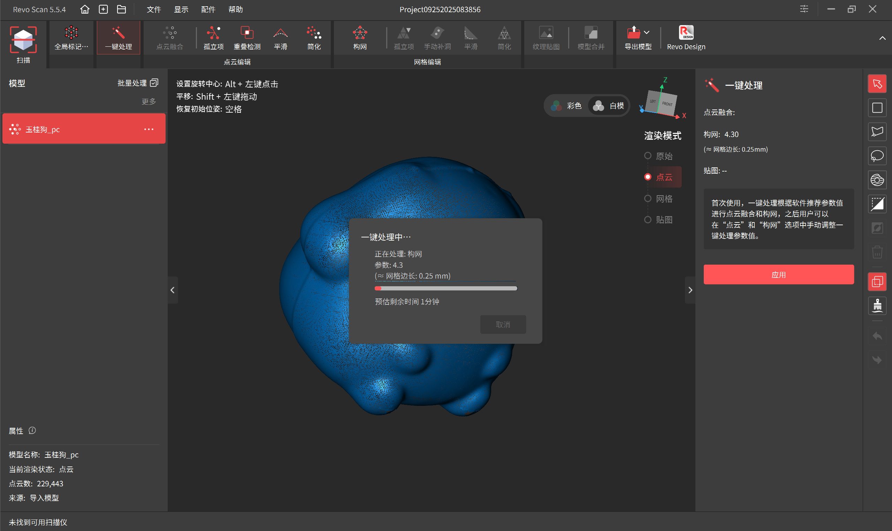
#####       注意：有些位置可能扫描不完全，构网以后出现破洞，可以借用软件内的工具手动补洞。
##### Note: Some parts may not be fully scanned, resulting in holes after mesh construction. You can use the built-in tools in the software to manually fill these holes.
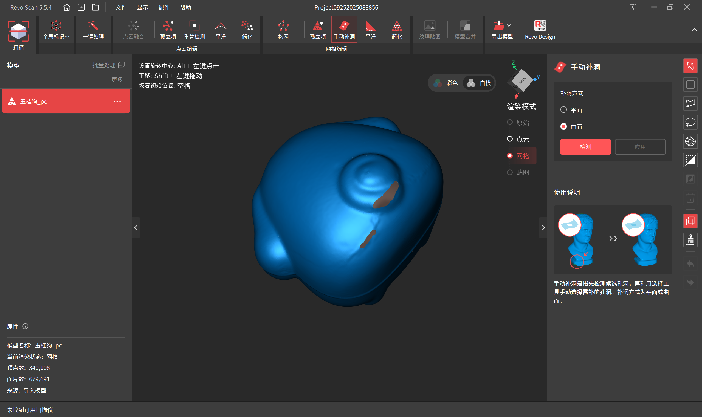
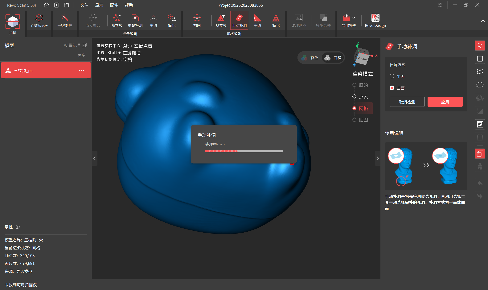
####     2、基本处理完后导出为obj格式，然后可以使用常见的建模软件进行后期处理。（此处使用的是blender）
####  After basic processing, export the model in OBJ format. Then, you can use common modeling software for post-processing. (Blender is used here).
##### 比如说这里加强了一下玉桂狗的五官并且为它加上了一个挂环。
##### For example, the facial features of Cinnamoroll were enhanced here, and a hanging loop was added to it.
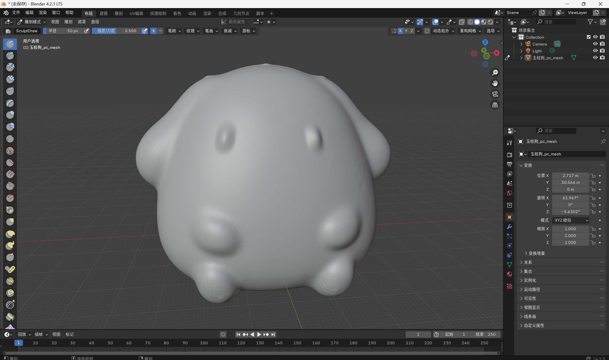
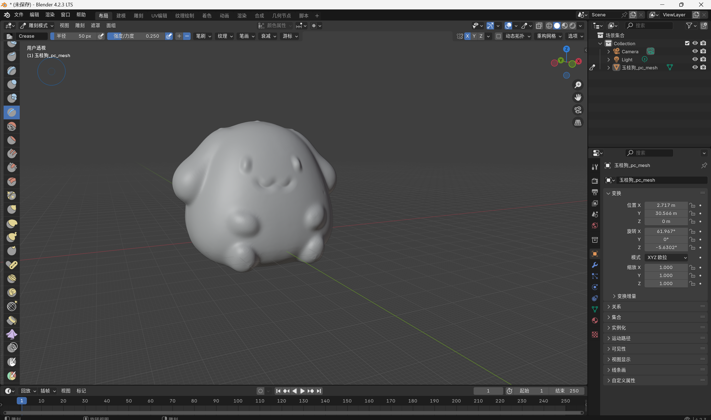
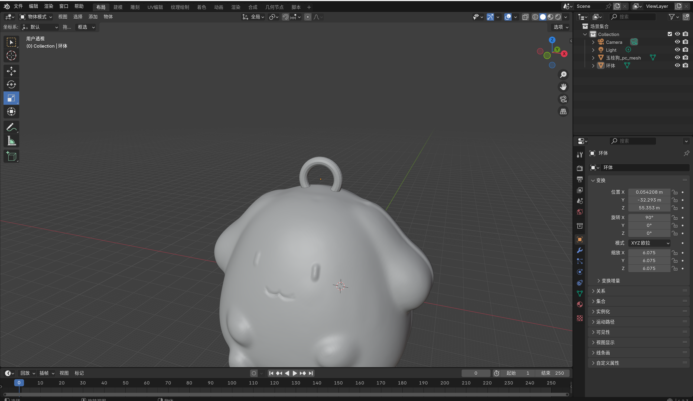
####     3、二次加工完成后，再次导出为obj格式。
#### After the secondary processing is completed, export the model in OBJ format again.

# 打印准备 Printing Preparation
### 软件：UltiMaker Cura
### Software: UltiMaker Cura

#### 1、打开软件，拖入准备好的obj模型。（需要提前设置好打印机）
#### Open the software and drag the prepared OBJ model into it. (The 3D printer needs to be set up in advance.)
!拖入模型](pictures/processing3.1.png)
#### 2、在软件内调整合适的角度和大小。
#### Adjust the model to an appropriate angle and size in the software.
##### 主要要注意与底面接触的面尽量地大和平整。
##### The main thing to note is that the surface of the model that contacts the bottom should be as large and flat as possible.
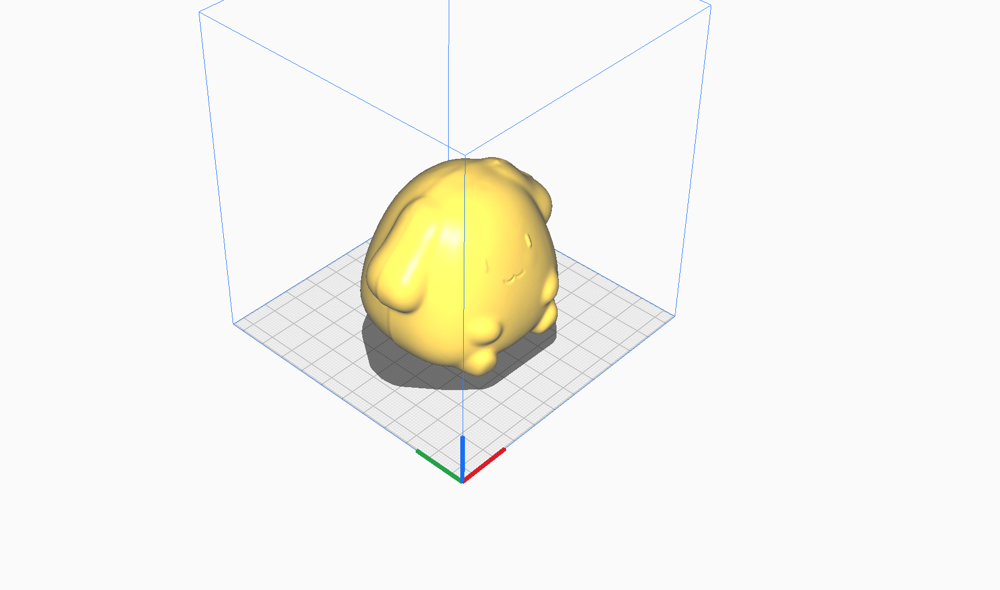
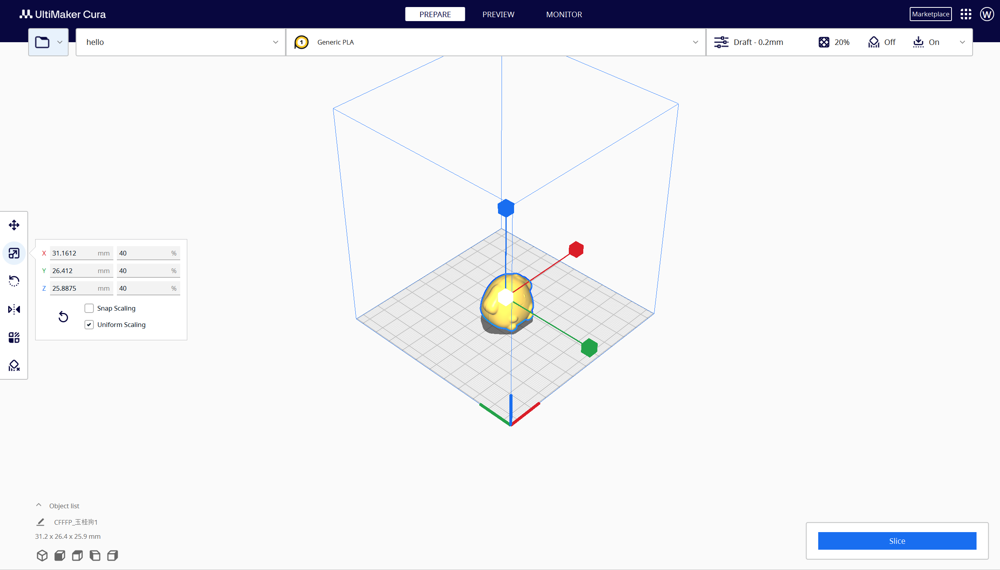
#### 3、设置打印参数
#### Set the printing parameters.
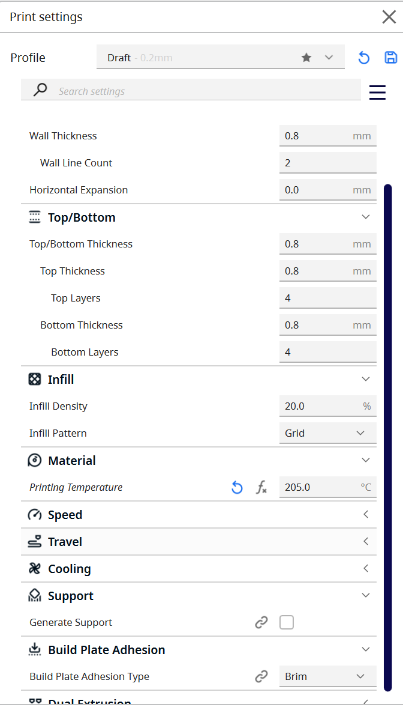
##### 如有悬空面，可以考虑添加支撑。
##### If there are overhanging surfaces, consider adding supports.
#### 4、一切准备就绪，切片导出到移动盘。
#### Once everything is ready, slice the model and export it to a removable disk.
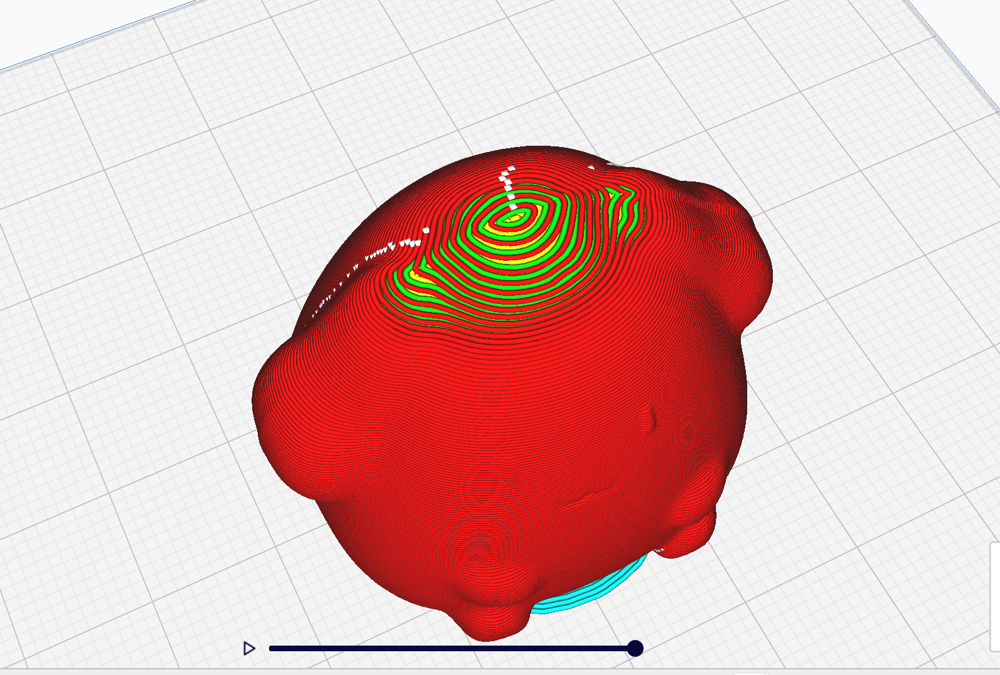
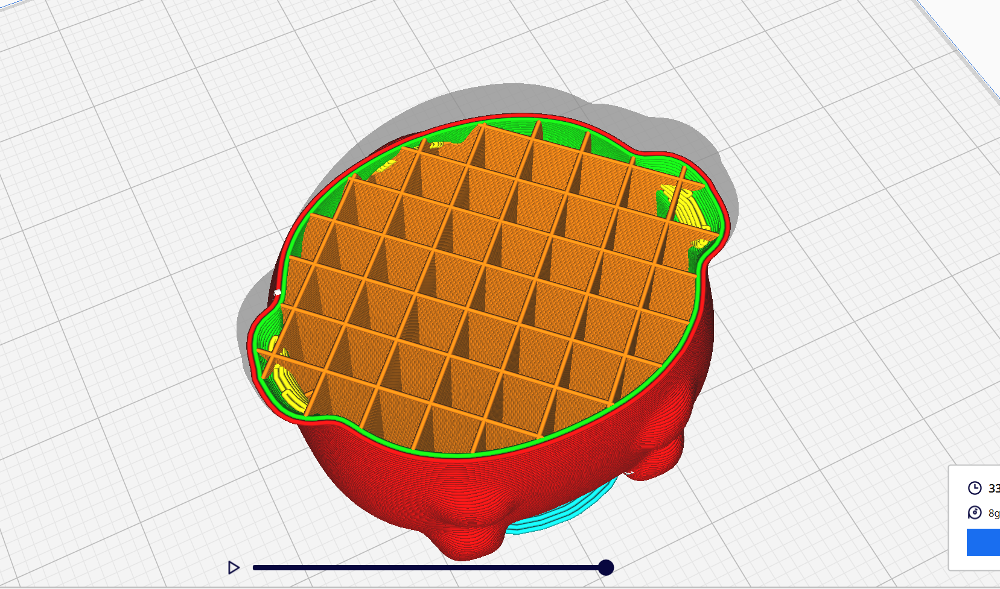

# 打印 Printing
### 工具：3D打印机
### Tool: 3D Printer
#### 1、启动打印机，加热喷头，加料
#### Start the 3D printer, heat the nozzle, and load the printing material.
#### 2、选择文件，打印
#### Select the sliced file and start printing.
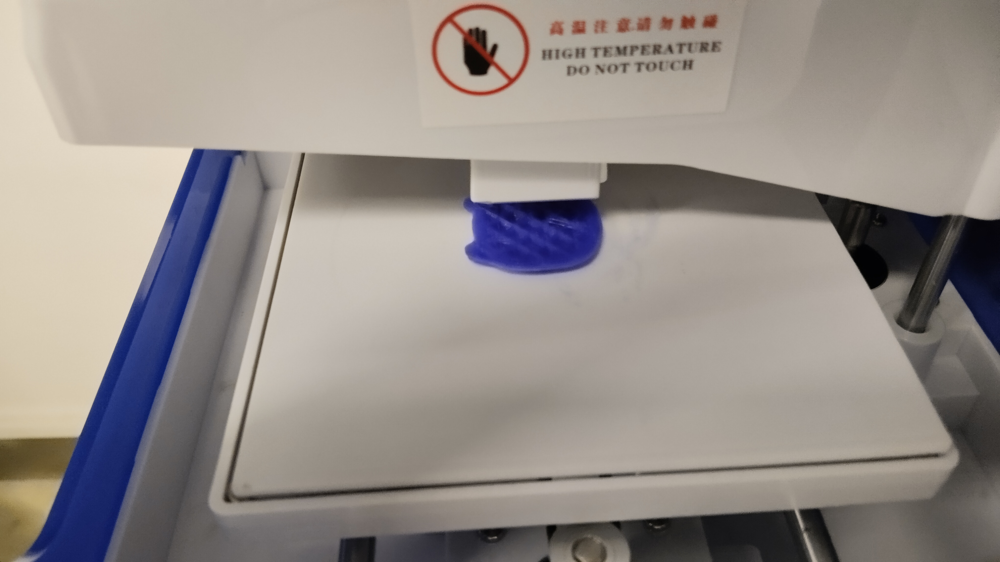
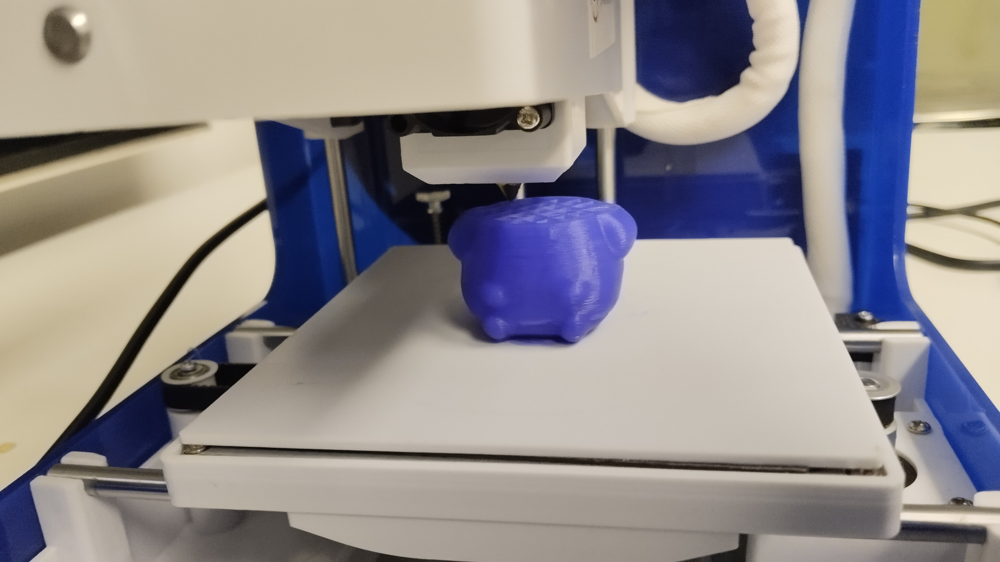

# 成果展示 Result Display
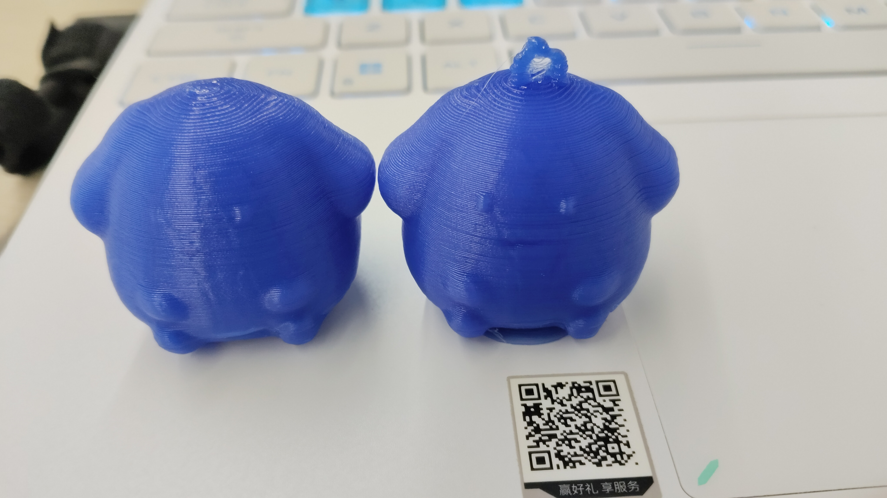
##### 由于第一次打印的时候五官画得不够深所以加强了一下并且加上圆环重新打印了一次。
##### Since the facial features were not carved deeply enough during the first printing, they were enhanced, and a loop was added before reprinting.
##### 圆环没有加支撑，效果感觉没有那么完美啊哈哈。
##### No supports were added for the loop, so the result isn't perfect, haha.
