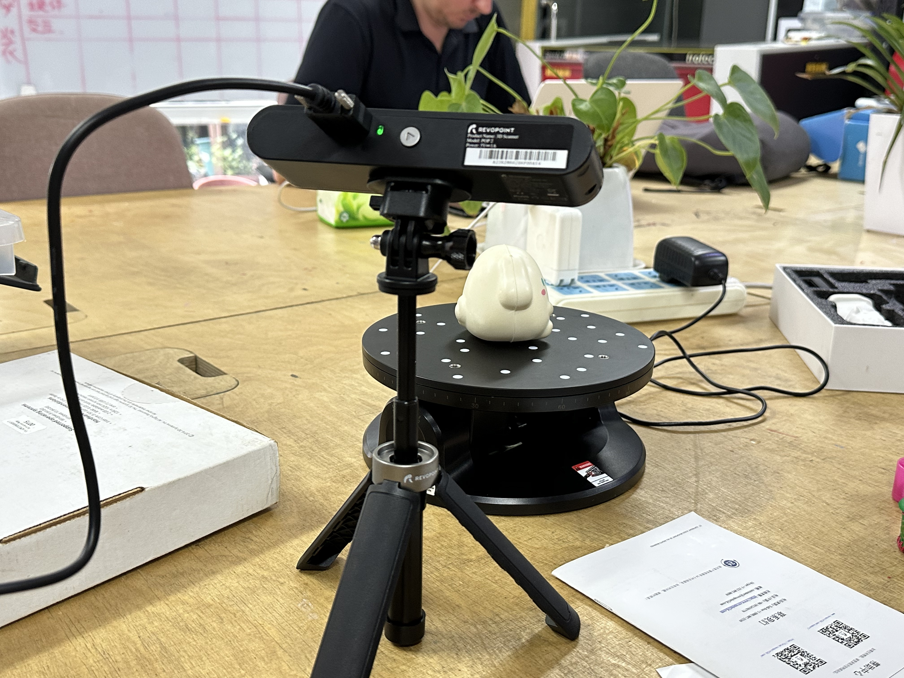
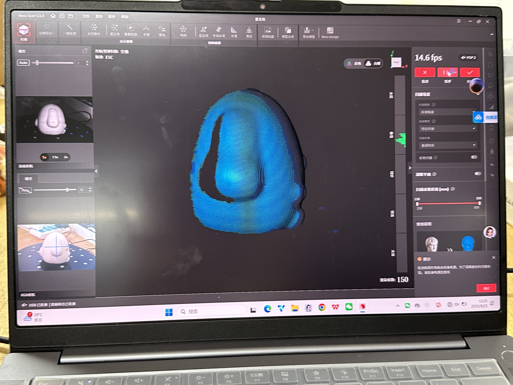
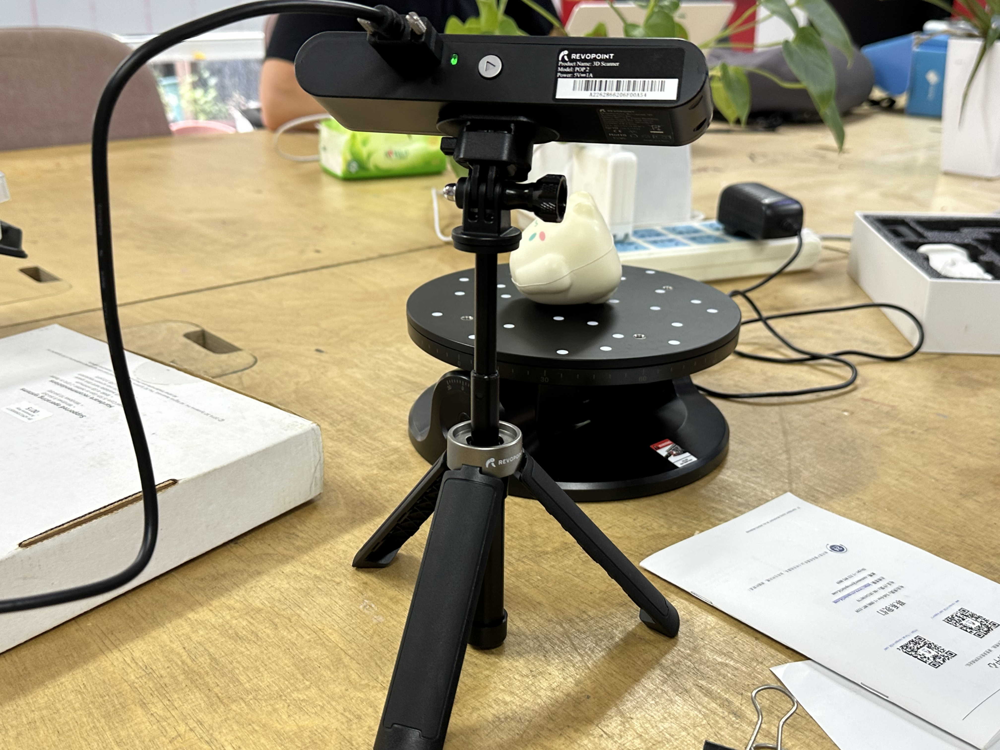
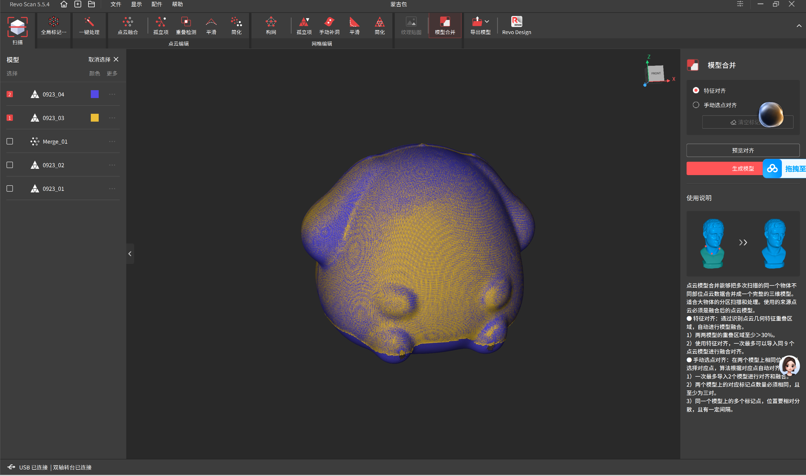

# 3D-Printing-Operation-and-Practice
A new attempt at 3D scanning, with post-processing and printing of the model carried out on this occasion.

# 扫描
### 工具：Revopoint扫描仪&转台
### 软件：Revo Scan（电脑端）
## 过程：
####     1、将扫描仪与转台连接到电脑
####     2、摆好待扫描的物品，调整合适的距离，（电脑上会有显示，然后也可以看预览效果）

####     3、启动转台，开始扫描，扫描完完整的一圈后结束
####     4、更换物品摆放角度再次扫描（为了扫描原来被遮住的部分）

####     5、扫描完成后在软件内合并两次的模型，并将点云连接成网格导出。

